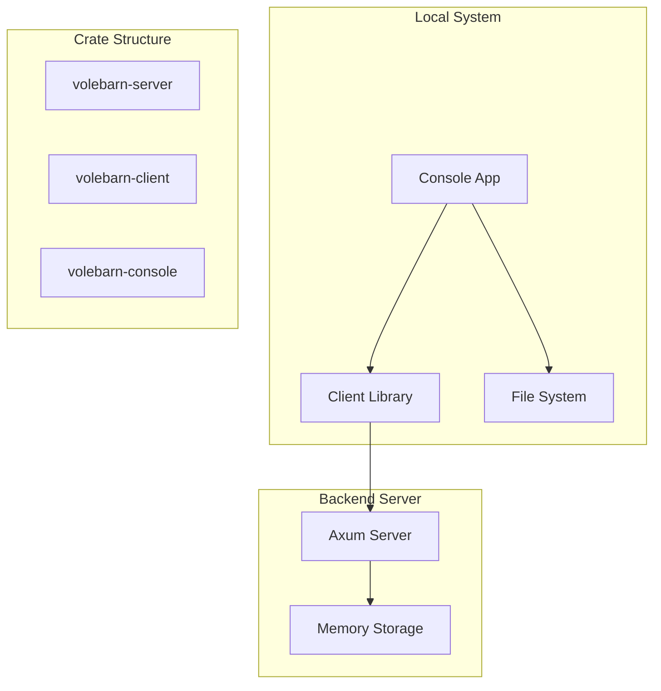

# Design Document

## Overview

Volebarn consists of three Rust crates implementing a client-server file synchronization architecture. The backend server uses Axum and Tokio for high-performance async HTTP handling with in-memory storage. The client library provides reusable async operations for file management, while the console application monitors local folders and syncs changes with the server.

**Performance Optimization:** Based on comprehensive benchmarks, Volebarn uses Snappy compression with Bitcode serialization for optimal performance. This combination achieves 651-2,225 MB/s complete pipeline throughput (serialize → compress → decompress → deserialize), which is 95-232% faster than traditional Bincode serialization approaches.

## Architecture



## Components and Interfaces

### Server Crate (`volebarn-server`)

**Core Components:**
- `Server`: Main application entry point with TLS 1.3 configuration using rustls
- `MetadataStore`: RocksDB-based metadata storage for file information and directory structure
- `FileStorage`: File system storage manager for actual file content with atomic operations
- `FileHandler`: HTTP route handlers for file operations with integrity verification
- `HashManager`: Handles file hashing using xxHash3 for fast integrity verification
- `TlsConfig`: TLS 1.3 configuration using rustls for cross-platform compatibility

**API Specification (OpenAPI 3.0):**

```yaml
openapi: 3.0.3
info:
  title: Volebarn File Sync API
  version: 1.0.0
  description: Lock-free file synchronization server with zero-copy operations

paths:
  # Single File Operations
  /files/{path}:
    post:
      summary: Upload file
      parameters:
        - name: path
          in: path
          required: true
          schema:
            type: string
      requestBody:
        content:
          application/octet-stream:
            schema:
              type: string
              format: binary
      responses:
        '201':
          description: File uploaded successfully
          content:
            application/json:
              schema:
                $ref: '#/components/schemas/FileMetadata'
        '400':
          $ref: '#/components/responses/BadRequest'
        '409':
          $ref: '#/components/responses/Conflict'
        '413':
          $ref: '#/components/responses/PayloadTooLarge'
        '500':
          $ref: '#/components/responses/InternalError'
    
    get:
      summary: Download file
      parameters:
        - name: path
          in: path
          required: true
          schema:
            type: string
      responses:
        '200':
          description: File content
          content:
            application/octet-stream:
              schema:
                type: string
                format: binary
          headers:
            X-File-Hash:
              schema:
                type: string
              description: xxHash3 of file content
        '404':
          $ref: '#/components/responses/NotFound'
        '500':
          $ref: '#/components/responses/InternalError'
    
    put:
      summary: Update file
      parameters:
        - name: path
          in: path
          required: true
          schema:
            type: string
      requestBody:
        content:
          application/octet-stream:
            schema:
              type: string
              format: binary
      responses:
        '200':
          description: File updated successfully
        '404':
          $ref: '#/components/responses/NotFound'
        '500':
          $ref: '#/components/responses/InternalError'
    
    delete:
      summary: Delete file
      parameters:
        - name: path
          in: path
          required: true
          schema:
            type: string
      responses:
        '204':
          description: File deleted successfully
        '404':
          $ref: '#/components/responses/NotFound'
        '500':
          $ref: '#/components/responses/InternalError'
    
    head:
      summary: Get file metadata
      parameters:
        - name: path
          in: path
          required: true
          schema:
            type: string
      responses:
        '200':
          description: File metadata
          headers:
            X-File-Size:
              schema:
                type: integer
            X-File-Hash:
              schema:
                type: string
            X-Modified-Time:
              schema:
                type: string
                format: date-time
        '404':
          $ref: '#/components/responses/NotFound'

  # Directory Operations
  /directories/{path}:
    post:
      summary: Create directory
      parameters:
        - name: path
          in: path
          required: true
          schema:
            type: string
      responses:
        '201':
          description: Directory created successfully
        '409':
          $ref: '#/components/responses/Conflict'
        '500':
          $ref: '#/components/responses/InternalError'
    
    delete:
      summary: Delete directory recursively
      parameters:
        - name: path
          in: path
          required: true
          schema:
            type: string
      responses:
        '204':
          description: Directory deleted successfully
        '404':
          $ref: '#/components/responses/NotFound'
        '500':
          $ref: '#/components/responses/InternalError'

  # Bulk Operations
  /bulk/upload:
    post:
      summary: Upload multiple files
      requestBody:
        content:
          multipart/form-data:
            schema:
              type: object
              properties:
                files:
                  type: array
                  items:
                    type: string
                    format: binary
      responses:
        '200':
          description: Bulk upload results
          content:
            application/json:
              schema:
                $ref: '#/components/schemas/BulkUploadResponse'
        '413':
          $ref: '#/components/responses/PayloadTooLarge'
        '500':
          $ref: '#/components/responses/InternalError'

  /bulk/manifest:
    get:
      summary: Get complete file manifest
      responses:
        '200':
          description: File manifest with checksums
          content:
            application/json:
              schema:
                $ref: '#/components/schemas/FileManifest'
        '500':
          $ref: '#/components/responses/InternalError'

  /bulk/sync:
    post:
      summary: Compare manifests and get sync operations
      requestBody:
        content:
          application/json:
            schema:
              $ref: '#/components/schemas/SyncRequest'
      responses:
        '200':
          description: Sync operations to perform
          content:
            application/json:
              schema:
                $ref: '#/components/schemas/SyncResponse'
        '400':
          $ref: '#/components/responses/BadRequest'
        '500':
          $ref: '#/components/responses/InternalError'

components:
  schemas:
    FileMetadata:
      type: object
      properties:
        path:
          type: string
        name:
          type: string
        size:
          type: integer
          format: int64
        modified:
          type: string
          format: date-time
        is_directory:
          type: boolean
        xxhash3:
          type: string
    
    FileManifest:
      type: object
      properties:
        files:
          type: object
          additionalProperties:
            $ref: '#/components/schemas/FileMetadata'
    
    SyncRequest:
      type: object
      properties:
        client_manifest:
          $ref: '#/components/schemas/FileManifest'
        conflict_resolution:
          type: string
          enum: [prefer_local, prefer_remote, prefer_newer, manual]
    
    SyncResponse:
      type: object
      properties:
        client_download:
          type: array
          items:
            type: string
        client_delete:
          type: array
          items:
            type: string
        client_upload:
          type: array
          items:
            type: string
        conflicts:
          type: array
          items:
            $ref: '#/components/schemas/SyncConflict'
    
    BulkUploadResponse:
      type: object
      properties:
        success:
          type: array
          items:
            type: string
        failed:
          type: array
          items:
            $ref: '#/components/schemas/OperationError'
    
    OperationError:
      type: object
      properties:
        path:
          type: string
        error:
          type: string
        error_code:
          type: string
          enum: [file_not_found, permission_denied, hash_mismatch, network_error, server_error]
    
    SyncConflict:
      type: object
      properties:
        path:
          type: string
        local_modified:
          type: string
          format: date-time
        remote_modified:
          type: string
          format: date-time
        resolution:
          type: string
          enum: [use_local, use_remote, use_newer, manual]

  responses:
    BadRequest:
      description: Bad request
      content:
        application/json:
          schema:
            $ref: '#/components/schemas/OperationError'
    
    NotFound:
      description: Resource not found
      content:
        application/json:
          schema:
            $ref: '#/components/schemas/OperationError'
    
    Conflict:
      description: Resource already exists
      content:
        application/json:
          schema:
            $ref: '#/components/schemas/OperationError'
    
    PayloadTooLarge:
      description: File or request too large
      content:
        application/json:
          schema:
            $ref: '#/components/schemas/OperationError'
    
    InternalError:
      description: Internal server error
      content:
        application/json:
          schema:
            $ref: '#/components/schemas/OperationError'
```

**Key Types:**
```rust
// Metadata stored in RocksDB using bincode serialization
#[derive(Debug, Clone, Serialize, Deserialize)]
struct FileMetadata {
    path: String,           // Full path including subdirectories
    name: String,           // Just the filename
    size: u64,
    modified: SystemTime,
    is_directory: bool,
    xxhash3: u64,          // xxHash3 for integrity verification
    storage_path: Option<String>, // Path to actual file on disk (None for directories)
}

// API response types using JSON serialization
#[derive(Debug, Serialize, Deserialize)]
struct FileMetadataResponse {
    path: String,
    name: String,
    size: u64,
    modified: String,      // ISO 8601 timestamp for JSON API
    is_directory: bool,
    hash: String,          // Hex-encoded hash for JSON API
}

// File content stored separately on file system
struct FileStorage {
    storage_root: PathBuf,  // Root directory for file storage
    metadata_db: Arc<rocksdb::DB>, // RocksDB for metadata
}

struct FileMetadata {
    path: String,           // Full path including subdirectories
    name: String,           // Just the filename
    size: u64,
    modified: SystemTime,
    is_directory: bool,
    xxhash3: u64,          // xxHash3 for integrity verification
}

struct DirectoryListing {
    path: String,
    entries: Vec<FileMetadata>,
}

// Bulk operation types
struct FileUpload {
    path: String,
    content: Bytes,
}

struct FileManifest {
    files: HashMap<String, FileMetadata>,  // path -> metadata
}

struct SyncPlan {
    // Client operations to match server state (server is source of truth)
    client_upload: Vec<String>,     // Files client has that server needs
    client_download: Vec<String>,   // Files server has that client needs
    client_delete: Vec<String>,     // Files client has but server doesn't (delete locally)
    client_create_dirs: Vec<String>, // Directories client needs to create
    
    // Only conflicts are when both sides modified the same file
    conflicts: Vec<SyncConflict>,   // Files that need conflict resolution
}

struct SyncConflict {
    path: String,
    local_modified: SystemTime,
    remote_modified: SystemTime,
    resolution: ConflictResolution,
}

enum ConflictResolution {
    UseLocal,    // Upload local version to server
    UseRemote,   // Download server version to client  
    UseNewer,    // Use the version with newer timestamp
    Manual,      // Requires user intervention
}

struct SyncResult {
    uploaded: Vec<String>,          // Files uploaded to server
    downloaded: Vec<String>,        // Files downloaded from server
    deleted_local: Vec<String>,     // Files deleted locally to match server
    created_dirs: Vec<String>,      // Directories created locally
    conflicts_resolved: Vec<String>, // Conflicts that were resolved
    errors: Vec<(String, String)>,  // path, error message
}

struct BulkUploadResponse {
    success: Vec<String>,
    failed: Vec<(String, String)>,  // path, error message
}

struct BulkDeleteResponse {
    success: Vec<String>,
    failed: Vec<(String, String)>,  // path, error message
}
```

### Client Library Crate (`volebarn-client`)

**Core Components:**
- `Client`: HTTPS client wrapper with TLS 1.3 and rustls, includes retry logic
- `FileOperations`: Async methods for all file operations with integrity verification
- `HashManager`: Client-side file hashing using xxHash3
- `Config`: Client configuration (server URL, TLS settings)
- `Error`: Custom error types for client operations including xxHash3 mismatch errors

**Public Interface:**
```rust
impl Client {
    // Single file operations
    async fn upload_file(&self, path: &str, content: Bytes) -> Result<()>;
    async fn download_file(&self, path: &str) -> Result<Bytes>;
    async fn update_file(&self, path: &str, content: Bytes) -> Result<()>;
    async fn delete_file(&self, path: &str) -> Result<()>;
    async fn get_file_metadata(&self, path: &str) -> Result<FileMetadata>;
    async fn move_file(&self, from: &str, to: &str) -> Result<()>;
    async fn copy_file(&self, from: &str, to: &str) -> Result<()>;
    
    // Directory operations
    async fn create_directory(&self, path: &str) -> Result<()>;
    async fn delete_directory(&self, path: &str) -> Result<()>;
    async fn list_directory(&self, path: Option<&str>) -> Result<DirectoryListing>;
    async fn search_files(&self, pattern: &str, path: Option<&str>) -> Result<Vec<FileMetadata>>;
    
    // Bulk operations (zero-copy)
    async fn bulk_upload(&self, files: Vec<FileUpload>) -> Result<BulkUploadResponse>;
    async fn bulk_download(&self, paths: Vec<&str>) -> Result<Vec<(String, Bytes)>>; // Returns individual files
    async fn bulk_delete(&self, paths: Vec<&str>) -> Result<BulkDeleteResponse>;
    async fn get_manifest(&self, path: Option<&str>) -> Result<FileManifest>;
    
    // Full sync operations
    async fn sync_plan(&self, local_manifest: FileManifest) -> Result<SyncPlan>;
    async fn apply_sync_plan(&self, plan: &SyncPlan) -> Result<SyncResult>;
    async fn full_sync(&self, local_path: &Path) -> Result<SyncResult>; // High-level sync method
    
    // Hash and integrity operations
    async fn verify_file_integrity(&self, path: &str, expected_hash: u64) -> Result<bool>;
}
```

### Console Application Crate (`volebarn-console`)

**Core Components:**
- `App`: Main application with TLS configuration and file watcher
- `FileWatcher`: Monitors local directory tree recursively for changes using notify crate
- `FileIndex`: In-memory index tracking entire directory tree state with checksums
- `SyncManager`: Coordinates full sync operations with integrity verification
- `ConflictResolver`: Handles sync conflicts based on configured strategy
- `LocalFileManager`: Manages local file operations with hash calculation


**Configuration:**
```rust
struct Config {
    server_url: String,
    local_folder: PathBuf,
    poll_interval: Duration,
}
```

## Data Models

### Storage Architecture

#### Server-side Storage
```rust
// Persistent metadata storage using RocksDB
struct MetadataStore {
    db: Arc<rocksdb::DB>,
    cf_files: rocksdb::ColumnFamily,      // File metadata
    cf_directories: rocksdb::ColumnFamily, // Directory structure
    cf_indexes: rocksdb::ColumnFamily,    // Secondary indexes (by hash, by modified time)
}

// Persistent file content storage on file system
struct FileStorage {
    storage_root: PathBuf,               // e.g., "./storage/files/"
    temp_dir: PathBuf,                   // e.g., "./storage/temp/" for atomic writes
    metadata_store: Arc<MetadataStore>,
}

// Temporary request-scoped state (not persistent)
struct RequestState {
    upload_progress: DashMap<String, UploadProgress>,  // Track bulk upload progress
    download_cache: DashMap<String, Bytes>,           // Cache for concurrent downloads
    operation_status: DashMap<String, OperationStatus>, // Track long-running operations
}

// All persistent data goes through MetadataStore (RocksDB) + FileStorage (file system)
// DashMap is only used for temporary, request-scoped state management

// Storage layout:
// ./storage/
//   ├── metadata/          # RocksDB database files
//   ├── files/             # Actual file content organized by hash
//   │   ├── ab/cd/ef...    # First 6 chars of hash for directory structure
//   │   └── temp/          # Temporary files during upload
//   └── config/            # Server configuration
```

#### Client-side Index
```rust
// Client tracks local state using DashMap for lock-free access
struct FileIndex {
    entries: DashMap<PathBuf, FileState>,
    local_db: Option<Arc<rocksdb::DB>>,  // Optional local RocksDB for persistence
}

struct FileState {
    hash: u64,
    size: u64,
    modified: SystemTime,
    is_directory: bool,
    sync_status: AtomicU8,  // Synced(0), Modified(1), Deleted(2), New(3)
}
```

#### Serialization Strategy

**API Layer (External Interface):**
- Use `serde_json` for all HTTP request/response bodies
- Human-readable, standard format for interoperability
- ISO 8601 timestamps, hex-encoded hashes for JSON compatibility

**Storage Layer (Internal Persistence):**
- Use `bitcode` for RocksDB value serialization (651-2,225 MB/s pipeline performance)
- Ultra-fast binary format with 5-42x faster serialization/deserialization than bincode
- Native Rust types (SystemTime, u64) preserved without conversion
- Zero additional memory overhead compared to bincode

**Compression Strategy:**
- Use `Snappy` compression for all serialized data requiring compression
- Optimal balance: 651-2,225 MB/s complete pipeline speed with 2-15x compression ratios
- Zero additional memory overhead, excellent CPU efficiency (278 MB/s per core)
- Benchmark results show Snappy+Bitcode dominates all other combinations:
  - File Metadata: 651 MB/s (95% faster than Snappy+Bincode)
  - Code Files: 2,225 MB/s (232% faster than Snappy+Bincode)
  - Directory Listings: 669 MB/s (86% faster than Snappy+Bincode)
  - Mixed Content: 721 MB/s (96% faster than Snappy+Bincode)

**Performance Rationale:**
- Bitcode serialization: 5-42x faster than bincode (17,975 MB/s vs 2,321 MB/s)
- Bitcode deserialization: 42x faster than bincode (60,485 MB/s vs 1,450 MB/s)
- Snappy compression: 959-4,376 MB/s with excellent ratios for structured data
- Combined pipeline achieves 651-2,225 MB/s end-to-end performance

```rust
// Conversion between internal and external formats
impl From<FileMetadata> for FileMetadataResponse {
    fn from(metadata: FileMetadata) -> Self {
        Self {
            path: metadata.path,
            name: metadata.name,
            size: metadata.size,
            modified: metadata.modified.duration_since(UNIX_EPOCH)
                .unwrap().as_secs().to_string(),
            is_directory: metadata.is_directory,
            hash: format!("{:016x}", metadata.xxhash3),
        }
    }
}

impl TryFrom<FileMetadataResponse> for FileMetadata {
    type Error = ServerError;
    
    fn try_from(response: FileMetadataResponse) -> Result<Self, Self::Error> {
        let timestamp = response.modified.parse::<u64>()
            .map_err(|_| ServerError::InvalidTimestamp)?;
        let modified = UNIX_EPOCH + Duration::from_secs(timestamp);
        let xxhash3 = u64::from_str_radix(&response.hash, 16)
            .map_err(|_| ServerError::InvalidHash)?;
            
        Ok(Self {
            path: response.path,
            name: response.name,
            size: response.size,
            modified,
            is_directory: response.is_directory,
            xxhash3,
            storage_path: None, // Set separately by storage layer
        })
    }
}
```

#### RocksDB Schema Design
```rust
// Column Families and Key Formats:

// CF: files - Key: file_path -> Value: FileMetadata (serialized)
// Key: "/documents/file.txt" -> Value: FileMetadata { size, hash, modified, storage_path, ... }

// CF: directories - Key: dir_path -> Value: DirectoryMetadata
// Key: "/documents" -> Value: DirectoryMetadata { created, modified, child_count }

// CF: hash_index - Key: xxhash3 -> Value: file_path (for deduplication)
// Key: "1234567890abcdef" -> Value: "/documents/file.txt"

// CF: modified_index - Key: timestamp + path -> Value: empty (for time-based queries)
// Key: "20240101120000/documents/file.txt" -> Value: ""

impl MetadataStore {
    // Internal storage uses bitcode for ultra-fast binary serialization (5-42x faster than bincode)
    async fn get_file_metadata(&self, path: &str) -> Result<Option<FileMetadata>> {
        let key = path.as_bytes();
        if let Some(value) = self.db.get_cf(&self.cf_files, key)? {
            let metadata: FileMetadata = bitcode::decode(&value)?;
            Ok(Some(metadata))
        } else {
            Ok(None)
        }
    }
    
    async fn put_file_metadata(&self, path: &str, metadata: &FileMetadata) -> Result<()> {
        let key = path.as_bytes();
        let value = bitcode::encode(metadata);
        self.db.put_cf(&self.cf_files, key, value)?;
        Ok(())
    }
    
    async fn delete_file_metadata(&self, path: &str) -> Result<()>;
    async fn list_directory(&self, path: &str) -> Result<Vec<FileMetadata>>;
    async fn find_by_hash(&self, hash: u64) -> Result<Option<String>>;
    async fn get_files_modified_since(&self, timestamp: SystemTime) -> Result<Vec<String>>;
}
```

#### File Content Management
```rust
impl FileStorage {
    // Store file content using content-addressable storage
    async fn store_file(&self, content: Bytes, metadata: FileMetadata) -> Result<String> {
        let hash = xxhash3(&content);
        let storage_path = self.hash_to_path(hash);
        
        // Check if file already exists (deduplication)
        if let Some(existing_path) = self.metadata_store.find_by_hash(hash).await? {
            // File content already exists, just update metadata
            self.metadata_store.put_file_metadata(&metadata.path, &metadata).await?;
            return Ok(existing_path);
        }
        
        // Write file atomically using temp file + rename
        let temp_path = self.temp_dir.join(format!("{}.tmp", uuid::Uuid::new_v4()));
        tokio::fs::write(&temp_path, &content).await?;
        tokio::fs::rename(&temp_path, &storage_path).await?;
        
        // Update metadata in RocksDB
        let mut metadata = metadata;
        metadata.storage_path = Some(storage_path.to_string_lossy().to_string());
        self.metadata_store.put_file_metadata(&metadata.path, &metadata).await?;
        
        Ok(storage_path.to_string_lossy().to_string())
    }
    
    async fn retrieve_file(&self, path: &str) -> Result<Bytes> {
        let metadata = self.metadata_store.get_file_metadata(path).await?
            .ok_or(ServerError::FileNotFound { path: path.to_string() })?;
        
        let storage_path = metadata.storage_path
            .ok_or(ServerError::Storage { path: path.to_string(), error: "No storage path".to_string() })?;
        
        let content = tokio::fs::read(&storage_path).await?;
        Ok(Bytes::from(content))
    }
    
    fn hash_to_path(&self, hash: u64) -> PathBuf {
        let hash_str = format!("{:016x}", hash);
        // Create directory structure: ab/cd/ef/abcdef1234567890
        self.storage_root
            .join(&hash_str[0..2])
            .join(&hash_str[2..4])
            .join(&hash_str[4..6])
            .join(&hash_str)
    }
}
```

### HTTP Request/Response Models
```rust
// Single file operations
// Upload/Update request body: raw bytes (for files)
// Download response body: raw bytes (for files)

// Bulk operations use multipart/form-data for zero-copy uploads
struct BulkUploadRequest {
    files: Vec<FileUpload>,  // Each file uploaded as separate multipart section
}

struct BulkSyncRequest {
    client_manifest: FileManifest,
    conflict_resolution: ConflictResolutionStrategy,
}

enum ConflictResolutionStrategy {
    PreferLocal,     // Local changes win (upload to server)
    PreferRemote,    // Remote changes win (download from server)
    PreferNewer,     // Newer timestamp wins
    Manual,          // Return conflicts for manual resolution
}

struct ApplySyncRequest {
    operations: SyncPlan,
    files_to_upload: Vec<FileUpload>,  // Files being uploaded as part of sync
}

struct MoveRequest {
    from_path: String,
    to_path: String,
}

struct CopyRequest {
    from_path: String,
    to_path: String,
}

struct SearchRequest {
    pattern: String,
    path: Option<String>,  // Search within specific directory
    recursive: bool,
}

// Using xxHash3 for all file integrity verification
// Fast, hardware-optimized, and sufficient for detecting corruption

struct BulkDeleteRequest {
    paths: Vec<String>,
}

struct BulkDownloadRequest {
    paths: Vec<String>,  // Request specific files for download
}

struct BulkDownloadResponse {
    files: Vec<FileDownload>,  // Individual files, not archived
}

struct FileDownload {
    path: String,
    content: Bytes,  // Zero-copy file content
    xxhash3: u64,
}

// Directory operations: JSON
struct DirectoryListResponse {
    path: String,
    entries: Vec<FileMetadata>,
}

struct CreateDirectoryRequest {
    path: String,
}

// File operations support full paths with directories
// Examples: "folder/subfolder/file.txt", "documents/image.png"
```

## Error Handling and Resilience

### Error Classification and Recovery Strategies

#### Transient Errors (Retryable)
- **Network timeouts**: Retry with exponential backoff
- **Connection refused**: Server temporarily unavailable, retry with backoff
- **5xx server errors**: Server overloaded or temporary issue, retry
- **429 Rate limiting**: Respect retry-after header, exponential backoff
- **Hash verification failures**: Re-download and verify, up to 3 attempts

#### Permanent Errors (Non-retryable)
- **404 File not found**: Log and skip, continue with other operations
- **400 Bad request**: Invalid request format, log error and fail fast
- **413 Payload too large**: File exceeds server limits, skip file
- **403 Forbidden**: Authentication/authorization issue, fail operation

#### Partial Failure Handling
- **Bulk operations**: Continue processing remaining items if some fail
- **Sync operations**: Track failed items separately, retry later
- **File corruption**: Detect via hash mismatch, re-download automatically

### Custom Error Types
```rust
// Client library errors with detailed error codes
#[derive(Debug, thiserror::Error)]
enum ClientError {
    #[error("Network error: {0}")]
    Network(#[from] reqwest::Error),
    
    #[error("File not found: {path}")]
    FileNotFound { path: String },
    
    #[error("Server error: {status} - {message}")]
    Server { status: u16, message: String },
    
    #[error("Hash mismatch for {path}: expected {expected}, got {actual}")]
    HashMismatch { path: String, expected: String, actual: String },
    
    #[error("TLS error: {0}")]
    Tls(String),
    
    #[error("Timeout after {duration}s for operation: {operation}")]
    Timeout { duration: u64, operation: String },
    
    #[error("Rate limited: retry after {retry_after}s")]
    RateLimited { retry_after: u64 },
    
    #[error("Partial failure: {successful} succeeded, {failed} failed")]
    PartialFailure { successful: usize, failed: usize, errors: Vec<String> },
    
    #[error("Configuration error: {0}")]
    Config(String),
}

// Server errors with detailed context
#[derive(Debug, thiserror::Error)]
enum ServerError {
    #[error("File not found: {path}")]
    FileNotFound { path: String },
    
    #[error("Storage error for {path}: {error}")]
    Storage { path: String, error: String },
    
    #[error("Hash verification failed for {path}: expected {expected}, got {actual}")]
    HashVerificationFailed { path: String, expected: String, actual: String },
    
    #[error("TLS configuration error: {0}")]
    TlsConfig(String),
    
    #[error("Resource limit exceeded: {resource} - {limit}")]
    ResourceLimit { resource: String, limit: String },
    
    #[error("Concurrent modification detected for {path}")]
    ConcurrentModification { path: String },
}
```

### Retry Strategy with Circuit Breaker

#### Exponential Backoff Configuration
```rust
struct RetryConfig {
    initial_delay: Duration,      // 1s
    max_delay: Duration,          // 30s  
    max_attempts: u32,            // 5
    backoff_multiplier: f64,      // 2.0
    jitter: bool,                 // true - add randomness to prevent thundering herd
}

// Retry delays: 1s, 2s, 4s, 8s, 16s (with jitter)
```

#### Circuit Breaker Pattern
```rust
struct CircuitBreaker {
    failure_threshold: u32,       // 5 consecutive failures
    recovery_timeout: Duration,   // 30s before attempting recovery
    state: AtomicU8,             // Closed(0), Open(1), HalfOpen(2)
    failure_count: AtomicU32,
    last_failure: AtomicU64,     // Timestamp
}

// States:
// - Closed: Normal operation, track failures
// - Open: Fail fast, don't attempt requests
// - Half-Open: Allow single test request to check recovery
```

### Bulk Operation Resilience

#### Large File Upload Strategy
```rust
// For files > 10MB, use chunked upload with resume capability
struct ChunkedUpload {
    chunk_size: usize,           // 1MB chunks
    max_concurrent_chunks: usize, // 3 concurrent uploads
    resume_on_failure: bool,     // true
    chunk_retry_attempts: u32,   // 3 per chunk
}

// Process:
// 1. Split large file into chunks
// 2. Upload chunks concurrently with individual retry
// 3. If chunk fails, retry only that chunk
// 4. Server assembles chunks when all received
// 5. Verify final file hash
```

#### Bulk Sync Resilience
```rust
// Handle server unavailable during large sync
async fn resilient_sync(&self, local_path: &Path) -> Result<SyncResult> {
    let mut retry_queue = VecDeque::new();
    let mut completed = Vec::new();
    let mut failed = Vec::new();
    
    // Phase 1: Get manifest with retry
    let server_manifest = self.get_manifest_with_retry().await?;
    
    // Phase 2: Process operations in batches
    let operations = self.plan_sync(local_path, &server_manifest).await?;
    
    for batch in operations.chunks(10) { // Process 10 files at a time
        match self.process_batch(batch).await {
            Ok(results) => completed.extend(results),
            Err(e) => {
                // Add failed items to retry queue
                retry_queue.extend(batch.iter().cloned());
                tracing::warn!("Batch failed, queued for retry: {}", e);
            }
        }
    }
    
    // Phase 3: Retry failed operations with exponential backoff
    while let Some(operation) = retry_queue.pop_front() {
        match self.retry_operation(&operation).await {
            Ok(result) => completed.push(result),
            Err(e) => {
                failed.push((operation.path.clone(), e.to_string()));
                if retry_queue.len() < 100 { // Prevent infinite retry queue
                    retry_queue.push_back(operation); // Retry later
                }
            }
        }
    }
    
    Ok(SyncResult { completed, failed })
}
```

### Network Partition Handling

#### Offline Mode
```rust
struct OfflineQueue {
    pending_operations: DashMap<String, PendingOperation>,
    max_queue_size: usize,       // 1000 operations
    persistence_path: PathBuf,   // Save queue to disk
}

enum PendingOperation {
    Upload { path: String, content: Bytes, timestamp: SystemTime },
    Delete { path: String, timestamp: SystemTime },
    Move { from: String, to: String, timestamp: SystemTime },
}

// When server becomes available:
// 1. Process pending operations in timestamp order
// 2. Handle conflicts (server state may have changed)
// 3. Merge operations where possible (e.g., multiple edits to same file)
```

#### Health Monitoring
```rust
struct ServerHealth {
    last_successful_request: AtomicU64,  // Timestamp
    consecutive_failures: AtomicU32,
    average_response_time: AtomicU64,    // Moving average in ms
    is_healthy: AtomicBool,
}

// Health check strategy:
// - Lightweight ping every 30s when healthy
// - Exponential backoff when unhealthy (30s, 1m, 2m, 5m max)
// - Use HEAD requests to minimize server load
```

### Error Recovery Patterns

#### Graceful Degradation
- **Read-only mode**: When server is unavailable, allow local file access
- **Cached metadata**: Use local file index when server manifest unavailable
- **Partial sync**: Sync available files, queue others for later
- **User notification**: Clear status updates about sync state and errors

#### Data Consistency
- **Atomic operations**: Use DashMap for lock-free consistency
- **Hash verification**: Verify all file transfers with xxHash3
- **Conflict detection**: Compare timestamps and hashes for conflicts
- **Rollback capability**: Keep previous file versions for recovery

#### Monitoring and Observability
```rust
// Metrics to track
struct SyncMetrics {
    files_synced: AtomicU64,
    bytes_transferred: AtomicU64,
    sync_errors: AtomicU64,
    network_errors: AtomicU64,
    hash_mismatches: AtomicU64,
    average_sync_time: AtomicU64,
    server_response_times: Vec<AtomicU64>, // Histogram
}

// Structured logging with tracing
tracing::info!(
    path = %file_path,
    size = file_size,
    duration_ms = sync_duration.as_millis(),
    "File sync completed"
);

tracing::error!(
    path = %file_path,
    error = %error,
    attempt = retry_attempt,
    "File sync failed, will retry"
);
```

## Testing Strategy

### Unit Tests
- File storage operations (CRUD)
- Client library HTTP operations with mock server
- File index operations and change detection
- Configuration parsing and validation

### Integration Tests
- End-to-end file sync scenarios
- Server startup and shutdown
- Client-server communication with real HTTP
- File watcher integration with filesystem events

### Test Data
- Small text files (< 1KB) for basic operations
- Medium binary files (1-10MB) for performance testing
- Directory structures with nested folders
- Mixed file types: text, binary, images, documents
- Edge cases: empty files, empty directories, special characters in paths
- Deep directory nesting scenarios

## Sync Strategy

### Server as Source of Truth (Default)
Volebarn uses a "server as source of truth" approach where:
- Server state is authoritative
- Client syncs to match server state
- Files deleted on server are deleted locally
- Files added on server are downloaded locally
- Local-only files are uploaded to server
- Conflicts only occur when both sides modify the same file

### Sync Process
1. **Get Manifests**: Client gets both local and server file manifests with checksums
2. **Compare**: Client compares manifests to determine differences
3. **Create Plan**: Generate sync plan with required operations
4. **Resolve Conflicts**: Handle files modified on both sides
5. **Execute**: Perform uploads, downloads, and local deletions
6. **Verify**: Confirm sync completed successfully

### Alternative: Bidirectional Sync
For advanced use cases, bidirectional sync can be enabled where:
- Both client and server can be sources of truth
- More complex conflict resolution is required
- Requires careful handling of concurrent modifications

## Performance Considerations

### Zero-Copy Optimizations
- Use `Bytes` type for all file content to enable zero-copy
- Stream large files using `Body::from_stream` for uploads and downloads
- Use multipart/form-data for bulk uploads without creating archives
- Bulk downloads return individual files, not compressed archives
- Avoid unnecessary serialization/deserialization of file content
- Use memory mapping for large file operations where possible

### Memory Management
- Use `Arc<RwLock<>>` for shared file storage
- Implement file size limits to prevent memory exhaustion
- Consider LRU eviction for production use

### Concurrency
- Server handles multiple concurrent requests
- Client uses connection pooling via reqwest
- File watcher processes events asynchronously

## Configuration

### Server Configuration
```toml
[server]
host = "127.0.0.1"
port = 3000
max_file_size = "100MB"
# xxHash3 used for all file integrity verification

[tls]
enabled = true
cert_path = "./certs/server.crt"
key_path = "./certs/server.key"
```

### Client Configuration
```toml
[client]
server_url = "https://127.0.0.1:3000"  # HTTPS by default
local_folder = "./sync"
poll_interval = "5s"
retry_attempts = 5
# xxHash3 used for all file integrity verification
verify_integrity = true

[tls]
verify_certificates = true
ca_cert_path = "./certs/ca.crt"  # Optional custom CA
```